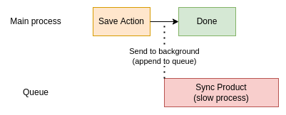

<p align="center">


[](https://packagist.org/packages/discorgento/module-queue)
</p>

A dev-friendly approach to handle background jobs in Magento 2

## Overview 💭
Now and then we need to execute processes that can take some time to execute, and that doesn't necessarily need to be done in real time. Like (but not limited to) third-party integrations.

For example, let's say you need to reflect product changes made by the storekeeper through the admin panel to their PIM/ERP. You can observe the `catalog_product_save_after` event and push the changes, but this would make the "Save" admin action become a hostage of the third-party system response time, potentially making the store admin reeealy slow.


But fear not citizens, because [we](https://discord.io/Discorgento) are here!  


## Installation 🔧
This module is compatible with both Magento 2.3 and Magento 2.4, from PHP 7.2 to 7.4.
```sh
composer require discorgento/module-queue
bin/magento setup:upgrade
```

## Usage ⚙️
There's just two steps needed: 1) append a job to the queue, 2) create the job class itself ([similar to Laravel](https://laravel.com/docs/9.x/queues#class-structure)).



Let's go back to the product sync example. You can now write the `catalog_product_save_after` event observer like this:

```php
class ProductSaveAfter implements \Magento\Framework\Event\ObserverInterface
{
    protected $queueHelper;

    public function __construct(
        \Discorgento\Queue\Helper\Data $queueHelper
    ) {
        $this->queueHelper = $queueHelper;
    }

    /** @inheritDoc */
    public function execute(
        \Magento\Framework\Event\Observer $observer
    ) {
        // append a job to the queue so it will run later in background
        $this->queueHelper->append(
            \YourCompany\YourModule\Jobs\SyncProduct::class, // job class, we'll create it below
            $observer->getProduct()->getId(), // job "target", in that case the product id
            ['foo' => $observer->getFoo()] // additional data for later usage (optional)
        );
    }
}
```

Now, create the job itself, like _app/code/YourCompany/YourModule/Jobs/SyncProduct.php_:

```php
// the job should implement the JobInterface
class SyncProduct implements \Discorgento\Queue\Api\JobInterface
{
    protected $productRepository;
    protected $productSynchronizer;

    public function __construct(
        \Magento\Catalog\Api\ProductRepositoryInterface $productRepository,
        \YourCompany\YourModule\Helper\Sync\Product $productSynchronizer
    ) {
        $this->productRepository = $productRepository;
        $this->productSynchronizer = $productSynchronizer;
    }

    /**
     * @param int|string|null $target The product id
     * @param array $additionalData Optional extra data inserted on append
     */
    public function execute($target, $additionalData)
    {
        // retrieve the product and sync it
        $product = $this->productRepository->getById($target);
        $this->productSynchronizer->sync($product);
    }
}
```

And.. that's it! In the next cron iteration (which should be within the next minute) your job will be executed without comprimsing the performance of the store at all, assuring a smooth workflow for both your clients and their customers.

> 💡 Any async process can benefit from this approach, your creativity is the limit.

## Debugging 🪲
You can force the queue execution whenever you want through [magerun2](https://github.com/netz98/n98-magerun2), using the sys:cron:run subcommand, like this:
`./n98-magerun2.phar sy:cr:run discorgento_queue`

Although we only recommend using this on developer mode; if in production mode just check the logs in *var/log/discorgento_queue.log*

## Roadmap 🧭
 - [ ] add a safety lock to prevent jobs from overflowing each other;
 - [ ] add an option on admin allowing to choose between cron and rabbitmq backend;
 - [ ] create console commands to execute (discorgento:queue:execute) and clear (discorgento:queue:clear) the queue;

## Footer notes 🗒
 - magento can do this natively through Message Queues, but those are ridiculously verbose to use;
 - issues and PRs are welcome in this repo;
 - We want **YOU** for [our community](https://discord.io/Discorgento);
